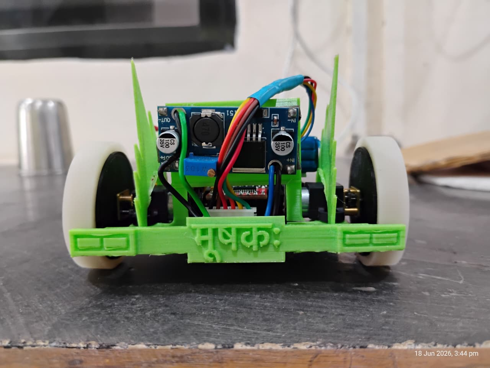

# Micromouse 🐭 
---
## Introduction 
A **Micromouse** is a small, autonomous, battery-operated robot designed to navigate through an **unknown maze**, map its layout and find the **fastest path** to the **GOAL**.

The mice are completely autonomous robots that must find their way from a predetermined starting position to the predetermined goal area of the maze unaided. The mouse needs to keep track of where it is, discover walls as it explores, map out the maze and detect when it has reached the goal. Having reached the goal, the mouse will typically perform additional searches of the maze until it has found an optimal route from the start to the finish. Once the optimal route has been found, the mouse will traverse that route in the shortest achievable time. 

---
## Design 

---

## Hardware Part

- **Microcontroller** - [ESP-32 Dev Module- 30-pins](https://randomnerdtutorials.com/getting-started-with-esp32/)
- **Motor with Encoder** - [N20_300Rpm](https://robu.in/product/n20-12v-300rpm-micro-metal-gear-motor-with-encoder/)
- **Motor Driver** - [TB6612fng](https://learn.sparkfun.com/tutorials/tb6612fng-hookup-guide/all)
- **Sensors**
  - [MPU 6050](https://robu.in/product/mpu-6050-gyro-sensor-2-accelerometer/)
  - [VL53L0X TOF Laser Distance Sensor](https://robu.in/product/vl53l0x-tof-based-lidar-laser-distance-sensor/)
- **Power**
  - LiPo-3S Battery 450mah
  - [AMS 5V-3.3V](https://media.digikey.com/pdf/Data%20Sheets/UTD%20Semi%20PDFs/AMS1117.pdf)
- **Swith**
- **Resistor** 
- **Leds**
- **Connector**
  
---

## Software Part 

- [**Platform.io**](https://platformio.org/)  - We use platform.io extesion in Vscode for handeling libraries and uploading code to ESP32.
  ### Library Used
  - [**TB6612FNG Motor Driver**](https://github.com/sparkfun/SparkFun_TB6612FNG_Arduino_Library) - For motor controlling. 
  - [**ESP32Encoder**](https://github.com/madhephaestus/ESP32Encoder.git)  - For Encoder data reading. 
  - [**MPU6050**](https://github.com/ElectronicCats/mpu6050.git)  - For controlling MPU 6050.
  - [**VL53L0X TOF Sensor Adafruit**](https://github.com/adafruit/Adafruit_VL53L0X.git)  - For controlling VL53L0X TOF sensor.
  - [**Vl53L0X TOF Sensor POLOLU**](https://github.com/pololu/vl53l0x-arduino.git) - For controlling VL53L0X TOF sensor.
  - [**APDS9960 Sensor**](https://github.com/adafruit/Adafruit_APDS9960.git) - For APDS9960 sensor.
  - [**APDS9960 Sensor**](https://github.com/sparkfun/SparkFun_APDS-9960_Sensor_Arduino_Library.git) - For APDS9960 sensor.
  - [**APDS9960 Sensor**](include/APDS9960.h) - Custom libraary for APDS9960 sensor.

----

# References 
https://medium.com/@minikiraniamayadharmasiri/micromouse-from-scratch-algorithm-maze-traversal-shortest-path-floodfill-741242e8510
https://ieee.ics.uci.edu/micromouse/floodfill.html
https://projects.ieeebruins.com/micromouse/
https://github.com/mackorone/mms#quick-start

https://github.com/Isuru-Dissanayake/piccola

https://www.youtube.com/watch?v=dwPsT8XuxmI

https://www.youtube.com/watch?v=Hv0q0KWkNRY&list=PLMcEwKreLg4WbNIPXqCeG6kCuqmIpM-QJ
https://www.youtube.com/watch?v=UHWE3d_au30&list=PLAWsHzw_h0iiPIaGyXAr44G0XfHfyjOe7

https://www.youtube.com/@MicroMouse/playlists

https://youtu.be/22l6MrAwN-o?si=qkaD5VaJFhBbaXGv
https://youtu.be/-JdkK7H62AA?si=DkABhCvv7nC_uFBX
